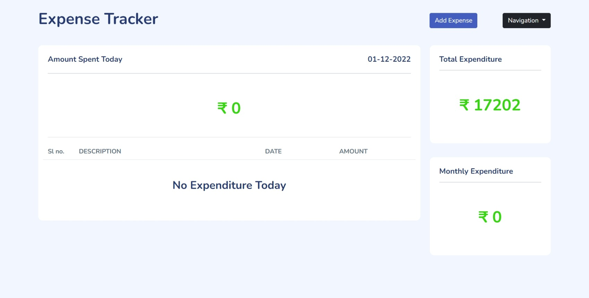
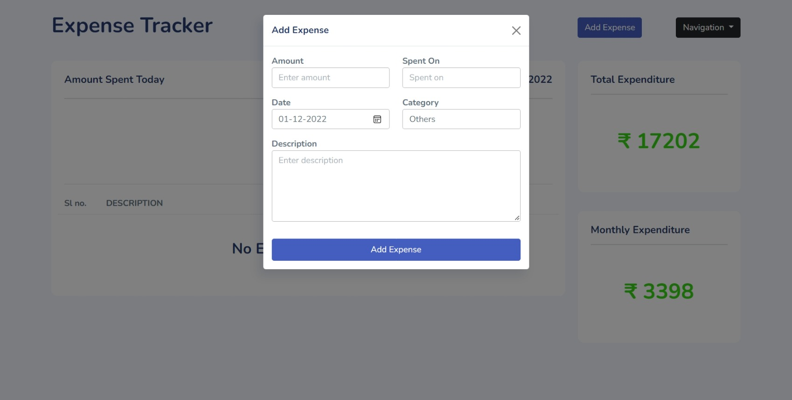
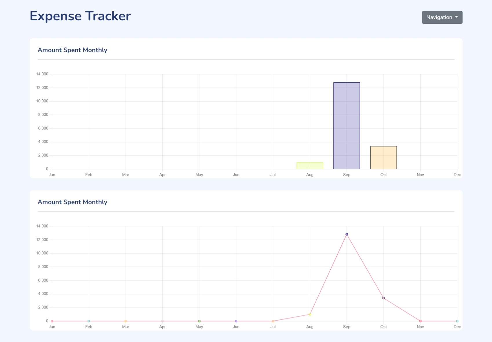
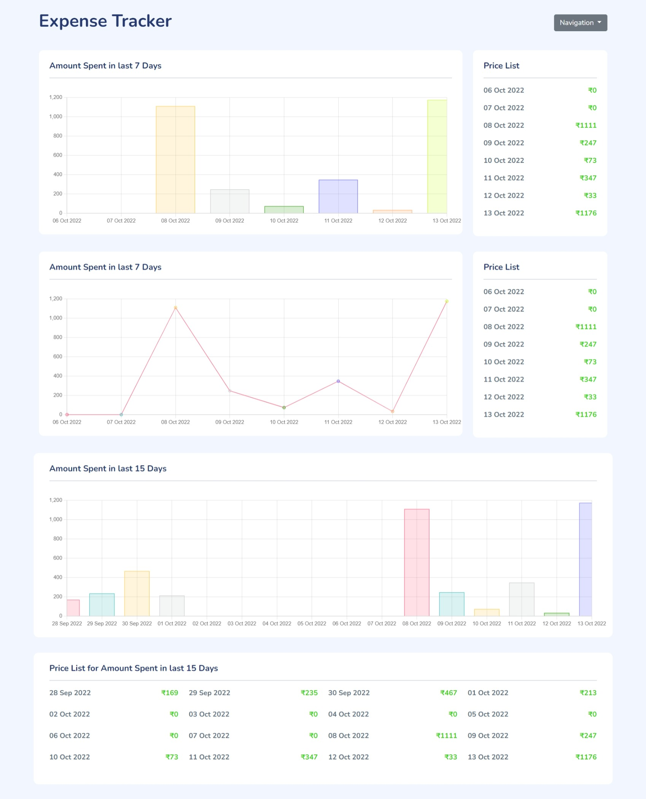

# EXPENSE TRACKER

#### A simple web based application to track your expenses. 
#### Made with **Django** and **Bootstrap**.

## Installation

1. Clone the repository
   ```
        git clone https://github.com/rishav-jha-mech/Expense-Tracker.git
   ```
2. Activate virtual environment
    ```
        pip install virtualenv
        virtualenv env
        cd env/Scripts
        activate
    ```
3. Install requirements - run this command on the root directory of the project
    ```
        pip install -r requirements.txt
    ```  
4. Run the project
    ```
        python manage.py migrate
        python manage.py runserver
    ```

## Screens

<h3 align="center">HOME SCREEN</h3>

<br/> 



<br/> 


<h3 align="center">ADD EXPENSE POPUP</h3>

<br/> 




<br/> 

<h3 align="center">MONTHLY EXPENSES</h3>

<br/> 



<br/> 

<h3 align="center">RECENT DAYWISE EXPENSES</h3>

<br/> 




<h3 align="center">Made with ❤️ by Rishav Jha</h3>
<p align="center">Feel free to open an issue if you find any bug or want to suggest any feature.</p>